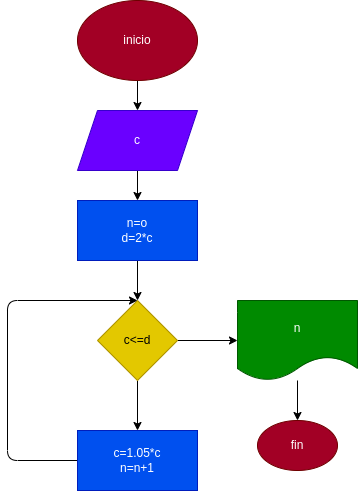

# INTERES_COMPUESTO
# hacer el diagrama de flujo y el diagrama en python,que lea un capital c,y que averigue imprima en cuantos meces se duplica si lo colocamos a un interes compuesto de 5% mensual 

# ANALISIS

--varrible de entrada 

c = capital

--variable de proceso

d = 2*doble del capital inicial 

---varible de salida 

n = numero de meses

# DISEÑO

# CONSTRUCCION